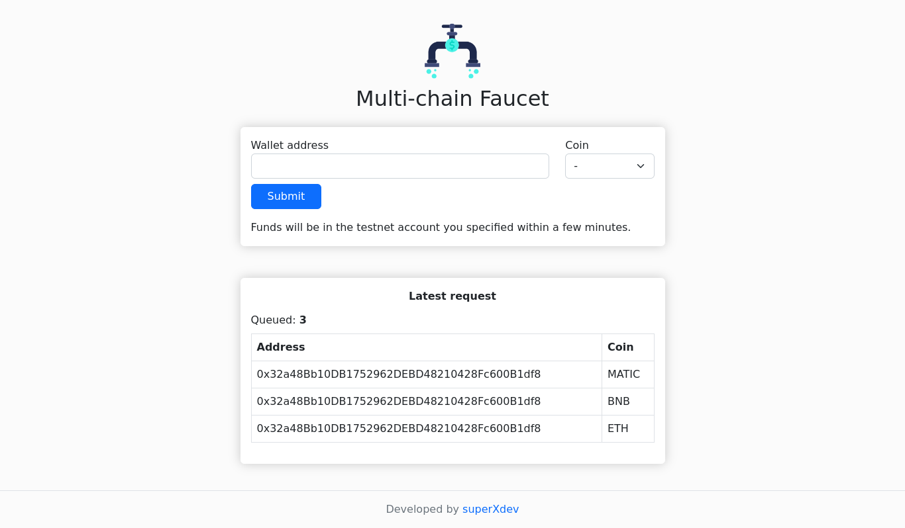

# Multi-chain Faucet



## Tech stack

* Expressjs
* Sequelize
* Web3js
* Bootstrap 5

## Installation

First you need to clone or fork this repository

```sh
git clone https://github.com/superXdev/multichain-faucet
```

Go to directory & install all dependecies using NPM

```sh
npm install
```
or using yarn

```sh
yarn
```

Create .env file

```sh
cp .env.example .env
```

### Database configuration

This faucet need a database to storing all request, edit the configuration file on `config/config.json`. Make sure you add it according to the `NODE_ENV` variable in the .env file

```json
"development": {
    "username": "root",
    "password": null,
    "database": "faucet",
    "host": "127.0.0.1",
    "dialect": "mysql",
    "logging": false
  }
  ...
```

### Global configuration

Everything you need to change is on .env file

> Note: because there is no security guarantee, make sure you enter a special private key for the faucet only


## License

Multi-chain Faucet is open-sourced software licensed under the GPL license